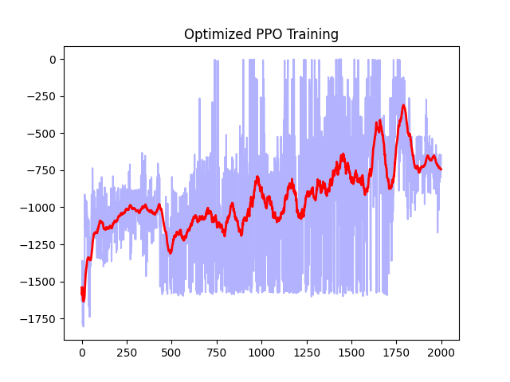

# UAV-Safe-RL-Algorithms
无人车安全路径规划算法库 - 大创项目。当前阶段：已复现 PPO 基础框架并针对连续空间完成 GAE 优化与力矩映射修正。后续计划：对接 Gazebo 实现避障并引入 TRPO/CPO 算法。

# 🚀 训练成果展示 (2026-04-12 更新)

本次更新包含了优化后的 PPO 算法及其训练结果：

- 算法改进：使用了 'nn.Tanh()' 激活函数替代 ReLU，并引入了奖励缩放 '(r + 8) / 8'。
- 最佳表现：平均奖励达到 -1.09 (Pendulum-v1 环境)。
- 模型权重：'models/best_ppo_actor.pth'。

## 训练收敛曲线

